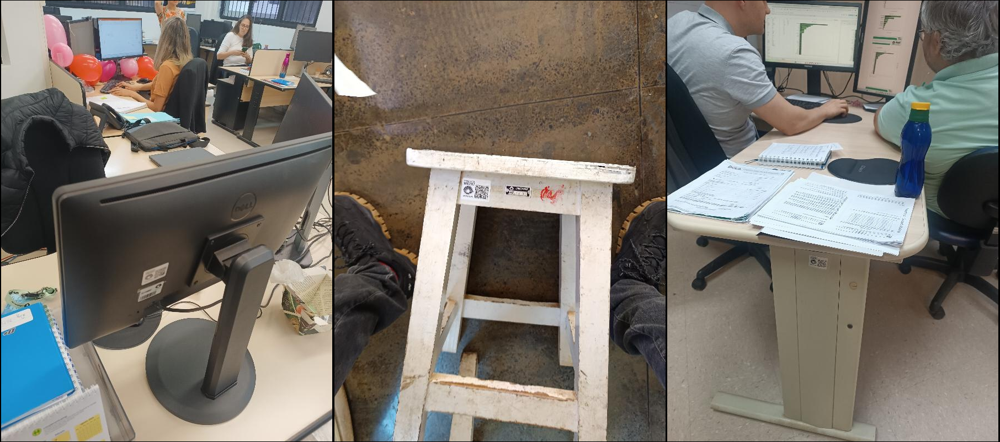
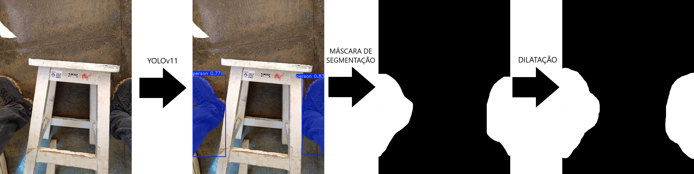
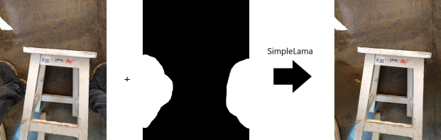
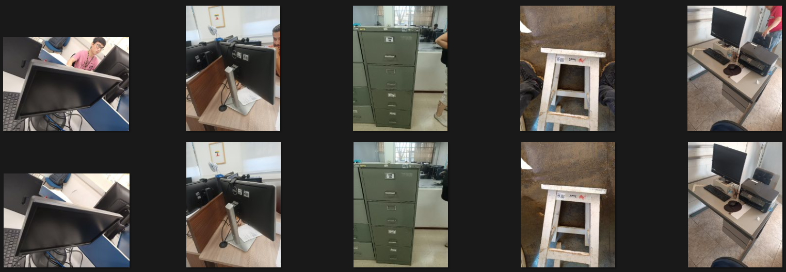
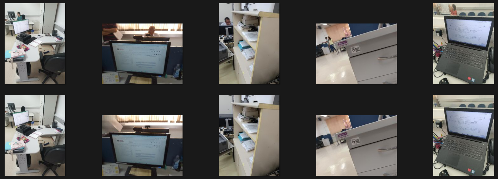
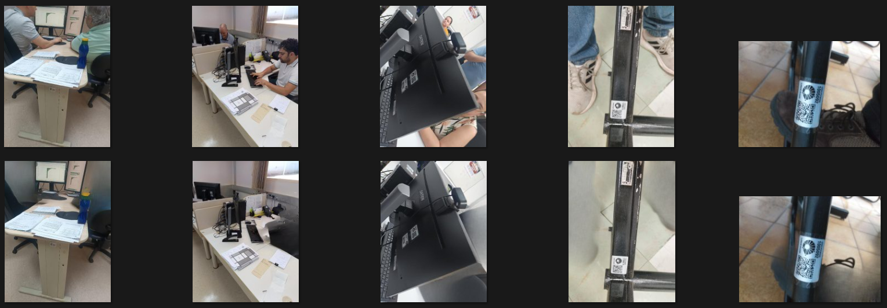
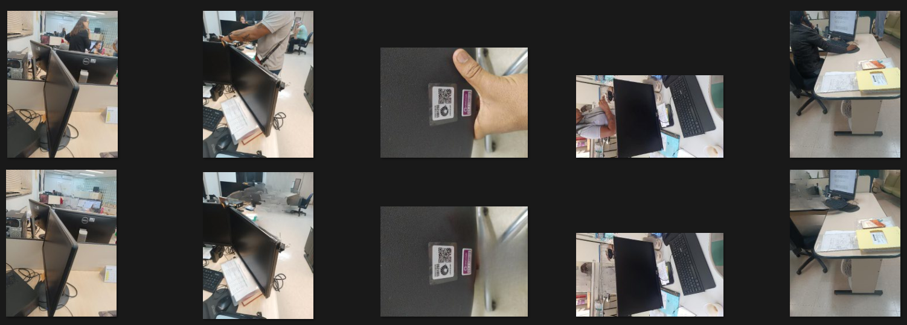

<!-- antes  de enviar a versão final, solicitamos que todos os comentários, colocados para orientação ao aluno, sejam removidos do arquivo -->
# Remoção de pessoas em imagens de inventário.

#### Aluno: [Everton Ferreira dos Santos](https://github.com/evrttn)
#### Orientador: [Vitor Bento de Sousa](https://github.com/link_do_github)

---

Trabalho apresentado ao curso [VC MASTER](https://ica.puc-rio.ai/vc-master) como pré-requisito para conclusão de curso e obtenção de crédito na disciplina "Projetos de Sistemas Inteligentes de Apoio à Decisão".

<!-- para os links a seguir, caso os arquivos estejam no mesmo repositório que este README, não há necessidade de incluir o link completo: basta incluir o nome do arquivo, com extensão, que o GitHub completa o link corretamente -->
- [Link para o código](https://github.com/evrttn/detect-remove-people). <!-- caso não aplicável, remover esta linha -->

---

### Resumo

Este trabalho objetivou remover pessoas ou parte de pessoas em imagens do inventário
patrimonial na Universidade Estadual de Campinas (Unicamp). A região detectada e segmentada foi apagada na imagem original, que depois foi restaurada usando o algoritmo SimpleLaMa de preenchimento de imagens (image inpainting). O tamanho da área removida e a complexidade do fundo a sua volta influenciaram na qualidade da saída obtida.

### Abstract 

This work aimed to remove people or parts of people from images in the asset inventory of the University of Campinas. The detected and segmented region was erased from the original image, which was then restored using the SimpleLaMa image inpainting algorithm. The size of the removed area and the complexity of the surrounding background influenced the quality of the resulting output.

### 1. Introdução
O avanço da tecnologia possibilitou o baratemamento e o amplo acesso à fotografia. Tirar fotos deixou de ser algo caro e demorado para uma atividade barata, fácil e cotidiana. Porém, é preciso conhecer e seguir algumas boas práticas quando se é contratado para fotografar bens materiais de uma instituição, como isolar e centralizar o objeto, iluminação adequada e resolução que permita avaliar o estado de conservação do bem.

Acontece que a universidade contratou, por meio de licitação pública, uma empresa para realizar o inventário e venceu aquela que ofertou o menor preço. Pagar pouco pelo serviço pode parecer o ideal no primeiro momento mas esconde problemas que vão aparecer no futuro. Ficou claro, só de olhar algumas das imagens entregues, que o quadro de funcionários da empresa consistia, em sua maioria, de amadores mal pagos. Tivemos mãos, calçados e até perna inteira do fotógrafo aparecendo na imagem (Figura 1). E os casos mais graves foram aqueles onde terceiros foram fotografados sem permissão ou consentimento, o que poderia gerar processos à Unicamp por infringir a LGPD e direitos de imagem.

Afim de previnir futuros custos processuais, usou-se o Yolov11 para investigar quais das mais de 800 mil fotos do banco de dados tinham pessoas. O Yolov11 foi escolhido por sua capacidade de detectar objetos em tempo real e, em conjunto com a máquina A100 do Google Colab, percorrer todas as imagens em tempo aceitável.

 
  
   <b>Figura 1 - Fotos de bens com pessoas ou partes de pessoas</b>

### 2. Modelagem

 
  
   <b>Figura 2 </b>

 
  
   <b>Figura 3 </b>

### 3. Resultados

 
  
   <b>Figura 4 - Ótimo</b>

 
  
   <b>Figura 5 - Pequeno</b>

 
  
   <b>Figura 6 - Vulto</b>

 
  
   <b>Figura 7 - Complexo</b>

### 4. Conclusões

Lorem ipsum dolor sit amet, consectetur adipiscing elit. Proin pulvinar nisl vestibulum tortor fringilla, eget imperdiet neque condimentum. Proin vitae augue in nulla vehicula porttitor sit amet quis sapien. Nam rutrum mollis ligula, et semper justo maximus accumsan. Integer scelerisque egestas arcu, ac laoreet odio aliquet at. Sed sed bibendum dolor. Vestibulum commodo sodales erat, ut placerat nulla vulputate eu. In hac habitasse platea dictumst. Cras interdum bibendum sapien a vehicula.

Proin feugiat nulla sem. Phasellus consequat tellus a ex aliquet, quis convallis turpis blandit. Quisque auctor condimentum justo vitae pulvinar. Donec in dictum purus. Vivamus vitae aliquam ligula, at suscipit ipsum. Quisque in dolor auctor tortor facilisis maximus. Donec dapibus leo sed tincidunt aliquam.

---

Matrícula: 241.100.461

Pontifícia Universidade Católica do Rio de Janeiro

Curso de Pós Graduação *Visão Computacional Master*
